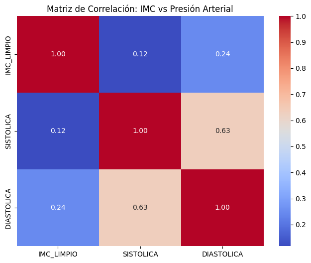
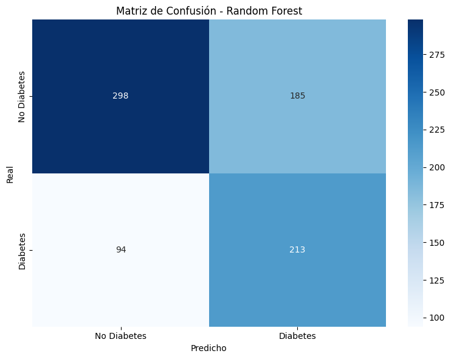
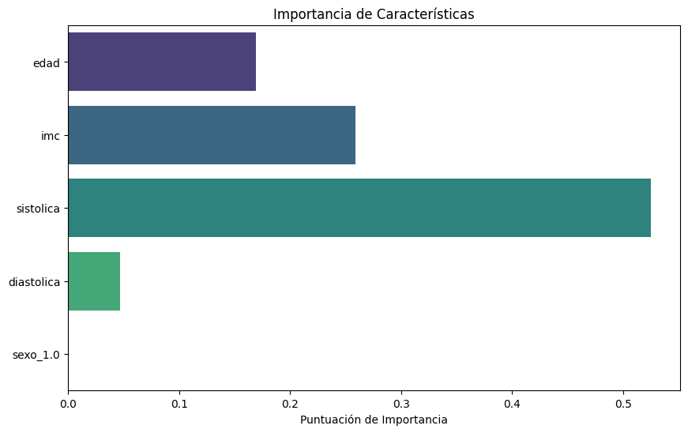
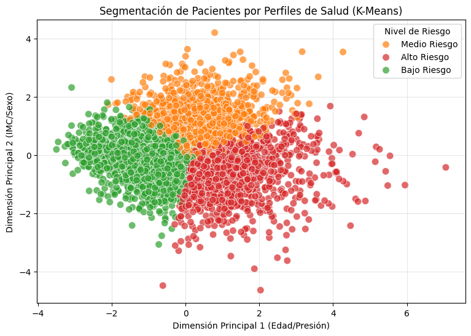

  
Samsung Innovation Campus

  <h1>Signal Lab</h1>
  
Predicción de Riesgo de Diabetes Tipo 2 mediante Inteligencia Artificial

  
  

    
Medina Mixtega Ángel Miguél

    
Plascencia Arevalo Alberto

    
Méndez Ortega Paula

    
Mota Barraza Moisés

    
Mendez Damián Brandon Efren

  

   
  

# Signal Lab: Predicción de Riesgo de Diabetes Tipo 2

### Inteligencia Artificial Aplicada a la Salud Pública en México (ENSANUT 2024)
## Tabla de Contenidos
- [Objetivo](#-emergencia-sanitaria-silenciosa)
- [Metodología](#️-metodología-y-arquitectura-de-datos)
- [Resultados](#-análisis-exploratorio-y-validación-biológica)
- [Modelado](#-resultados-torneo-de-algoritmos)
- [Perfiles de Riesgo](#-interpretabilidad-y-perfilamiento-k-means)

---

## 🇲🇽 Emergencia Sanitaria Silenciosa
México registra aproximadamente **169,425 nuevos diagnósticos** de DMT2 al año. El desafío de **Signal Lab** es transitar de una medicina *reactiva* a un tamizaje *preventivo predictivo* mediante métodos no invasivos.

> **Objetivo:** desarrollar modelos de Machine Learning que superen un **AUC-ROC de 0.70**, optimizando la detección en etapas preventivas sin depender de pruebas de laboratorio costosas.

---

## Metodología y Arquitectura de Datos
Nuestro pipeline integra cinco módulos fundamentales de la **ENSANUT Continua 2024**, logrando una visión holística del paciente.

### 1. Sincronización Multimodal (`FOLIO_I`)
Se diseñó una **Ingeniería de Identificadores Sintéticos** para resolver la disparidad de formatos entre módulos:
`FOLIO_I = UPM + VIV_SEL + NUM_REN`

### 2. Ingeniería de Características (Feature Engineering)
Trascendimos el uso de variables crudas creando indicadores biomédicos avanzados:
* **Presión de Pulso (PP):** `Sistólica - Diastólica` (Predictor de rigidez arterial).
* **Riesgo Combinado:** `Edad x IMC` (Captura el efecto multiplicador del envejecimiento y sobrepeso).

---

## Análisis Exploratorio y Validación Biológica

Para validar la integridad de los datos, realizamos un análisis de correlación de Pearson.

**

**Hallazgo Clave:** La baja correlación lineal individual entre IMC y Diabetes justifica el uso de **Inteligencia Artificial**, capaz de detectar patrones no lineales y relaciones de alto orden que los métodos tradicionales omiten.

---

## Resultados: Torneo de Algoritmos
Evaluamos múltiples arquitecturas, seleccionando **Random Forest** por su equilibrio y superioridad en la sensibilidad clínica.

| Modelo | F1-Score | AUC-ROC | Recall (Sensibilidad) |
| :--- | :---: | :---: | :---: |
| **Random Forest** | **0.60** | **0.71** | **0.69** |
| Gradient Boosting | 0.61 | 0.70 | 0.65 |
| Regresión Logística | 0.58 | 0.69 | 0.63 |
| SVM (Linear) | 0.57 | 0.68 | 0.59 |

### Matriz de Confusión y Seguridad del Paciente
Nuestro modelo identifica correctamente a **7 de cada 10 individuos en riesgo**, priorizando la reducción de falsos negativos.

**

---

## Interpretabilidad y Perfilamiento (K-Means)
No solo predecimos; entendemos la lógica del riesgo. La **Presión Sistólica** se consolidó como el predictor más determinante.

**

### Segmentación de Riesgo Poblacional
Identificamos tres fenotipos clínicos mediante **K-Means + PCA**:
* 🟢 **Bajo Riesgo:** Adultos jóvenes (Promedio 34.7 años).
* 🟠 **Riesgo Metabólico:** Mediana edad con el IMC más elevado (33.8).
* 🔴 **Riesgo Geriátrico:** Adultos mayores; el riesgo es dominado por el envejecimiento y la presión arterial.

**

---

##  Conclusiones y Estado del Arte
El sistema de **Signal Lab** alcanzó un **ROC-AUC de 0.7120**, situándose en el **límite superior de los estándares globales** para modelos de tamizaje no invasivos (Benchmarks internacionales NHANES establecen techos de 0.60 - 0.70).

---

## Referencias
* **American Diabetes Association.** (2023). *Standards of Care in Diabetes*.
* **Instituto Nacional de Salud Pública.** (2024). *ENSANUT Continua 2024*.
* **Zhang, L., et al.** (2014). *Predicting Type 2 Diabetes using non-invasive methods*. Scientific Reports.
